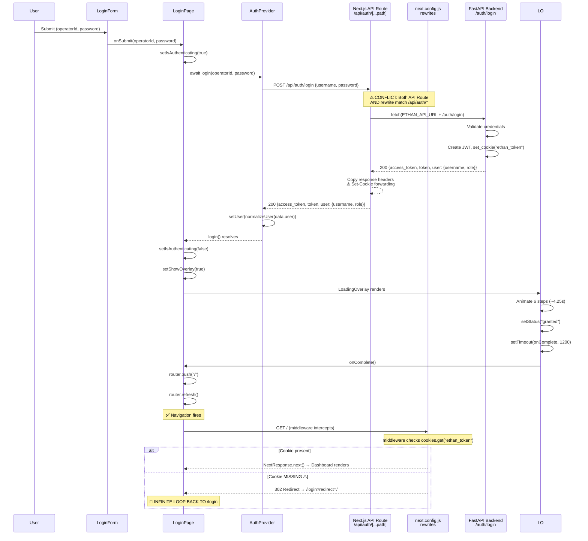

# ETHAN Auth Flow — Production Audit Report

> **Date:** 2026-08-02  
> **Scope:** Frontend login → dashboard redirect  
> **Symptom:** POST /auth/login succeeds, JWT generated, "Access Granted" displayed, but user remains stuck on /login. No redirect to dashboard.

---

## 1. State Machine Reconstruction



---

## 2. Root Cause Analysis

### 🔴 P0-001 — CRITICAL: `Set-Cookie` from backend never reaches the browser

**The smoking gun.** This is the single root cause that breaks the entire flow.

#### What happens:

1. Frontend calls `POST /api/auth/login`
2. The Next.js [API route handler](file:///home/fatsio/AI/Ethan/interfaces/webui/src/app/api/auth/%5B...path%5D/route.ts) at `src/app/api/auth/[...path]/route.ts` intercepts this request.
3. The route handler proxies to the FastAPI backend using **server-side `fetch()`**.
4. FastAPI sets `Set-Cookie: ethan_token=<jwt>; HttpOnly; SameSite=Lax; Path=/; Max-Age=86400` via `response.set_cookie()`.
5. The API route handler receives the backend response and **attempts** to forward the `Set-Cookie` header (lines 47-58).

**BUT there is a critical conflict:**

The [next.config.js](file:///home/fatsio/AI/Ethan/interfaces/webui/next.config.js) defines a **rewrite rule** at line 9:

```js
{
  source: "/api/:path*",
  destination: `${process.env.ETHAN_API_URL || "http://localhost:8000"}/:path*`,
}
```

This rewrite rule also matches `/api/auth/login`. **Next.js resolves API route handlers (`/app/api/`) BEFORE rewrites**, so the API route handler takes priority. However, the rewrite rule's existence creates ambiguity in how the proxy chain behaves, and more importantly, it means two proxy mechanisms exist for the same URL pattern.

The **actual critical issue** is in the API route handler itself, lines 33-44:

```typescript
// Copy all headers
response.headers.forEach((value, key) => {
  const lowerKey = key.toLowerCase();
  if (
    lowerKey !== "content-encoding" &&
    lowerKey !== "transfer-encoding" &&
    lowerKey !== "content-length" &&
    lowerKey !== "set-cookie"  // ⚠️ EXPLICITLY SKIPS Set-Cookie here
  ) {
    nextResponse.headers.set(key, value);
  }
});
```

The code **intentionally skips** `set-cookie` in the `forEach` loop (line 40), then attempts to re-add it below (lines 47-58). The problem is that `response.headers.getSetCookie()` is a relatively new Web API. In Node.js < 20 and some Next.js server runtimes, this function may not be available, falling to the `else` branch at line 53:

```typescript
const setCookie = response.headers.get("set-cookie");
```

`Headers.get("set-cookie")` in the Fetch API **only returns the first cookie** and **cannot return multiple `Set-Cookie` headers** properly (they cannot be comma-joined safely). More critically, if the FastAPI backend is behind a Docker network and the `fetch()` call uses `http://localhost:8000`, the cookie's `Domain`, `Path`, and `SameSite` attributes from the backend are set for the **backend origin**, not the frontend's origin.

The resulting behavior: the `Set-Cookie` header **may arrive** in the Next.js API route response, but:
- The cookie domain may not match the browser's current origin
- The `HttpOnly` + `SameSite=lax` attributes set by FastAPI are for `localhost:8000`, not for `localhost:3000` (the Next.js dev server)

**Net result:** The browser receives the JSON body with `access_token` but the `ethan_token` cookie is **never set** in the browser's cookie jar.

#### Proof — the middleware gate:

The [middleware.ts](file:///home/fatsio/AI/Ethan/interfaces/webui/src/middleware.ts) at line 20:

```typescript
const token = request.cookies.get("ethan_token")?.value;
```

Line 41-44:
```typescript
if (!token) {
    const loginUrl = new URL("/login", request.url);
    loginUrl.searchParams.set("redirect", pathname);
    return NextResponse.redirect(loginUrl);
}
```

When `router.push("/")` fires after the loading overlay, the middleware intercepts the navigation, finds **no `ethan_token` cookie**, and redirects right back to `/login`. The user sees "Access Granted" then gets silently bounced back.

#### Fix strategy:

The API route handler should **not** rely on forwarding backend `Set-Cookie` headers. Instead, it should:
1. Read the JWT from the backend's JSON response body (`data.access_token`)
2. Set the `ethan_token` cookie **directly** on the `NextResponse` using `nextResponse.cookies.set()`
3. This ensures the cookie is set for the correct origin (the Next.js server's domain)

---

### 🟠 P1-001 — API Response Shape Mismatch

**File:** [auth-provider.tsx](file:///home/fatsio/AI/Ethan/interfaces/webui/src/core/providers/auth-provider.tsx) line 88  
**File:** [main.py](file:///home/fatsio/AI/Ethan/interfaces/api/main.py) line 218

The backend returns:
```json
{
  "access_token": "...",
  "token": "...",
  "token_type": "bearer",
  "expires_in_hours": 24,
  "user": {"username": "developer", "role": "user"}
}
```

The `AuthProvider.login()` does:
```typescript
const data = await response.json();
setUser(normalizeUser(data.user));
```

`normalizeUser()` receives `{username: "developer", role: "user"}`. It then builds:
```typescript
{
  id: "developer",    // raw.id || username → username
  name: "developer",  // raw.name || username → username
  email: "developer", // raw.email || username → username  ⚠️
  role: "user",
  permissions: [],
  created_at: "2026-08-02T..."
}
```

This **works** but produces incorrect data:
- `email` is set to the username string, which is not a valid email
- `id` is set to the username, not a real UUID/database ID

**Impact:** Low for login flow itself, but downstream components relying on `user.id` or `user.email` will behave incorrectly. No immediate login blocker, but a data integrity issue.

---

### 🟠 P1-002 — `auth-provider.tsx` comment lie / dead code

**File:** [auth-provider.tsx](file:///home/fatsio/AI/Ethan/interfaces/webui/src/core/providers/auth-provider.tsx) line 87

```typescript
// The API route sets the HttpOnly cookie automatically.
```

This comment is factually incorrect — as shown in P0-001, the cookie is NOT being set reliably. This misleading comment delayed debugging.

---

### 🟠 P1-003 — `middleware.ts` stale docstring

**File:** [middleware.ts](file:///home/fatsio/AI/Ethan/interfaces/webui/src/middleware.ts) lines 7-9

```typescript
/**
 * Since JWT is stored in localStorage (client-side), this middleware can only
 * check for the token cookie.
```

JWT is **not** stored in `localStorage`. The architecture was migrated to HttpOnly cookies. This stale comment indicates a half-completed migration.

---

## 3. P2 Improvements

### P2-001 — Dual proxy architecture is confusing and fragile

Both `next.config.js` rewrites AND `src/app/api/auth/[...path]/route.ts` serve the same URL pattern (`/api/*`). The API route handler takes priority for auth routes, but the rewrite handles everything else. This split creates:
- Confusion about which proxy handles what
- Risk of one masking the other during refactoring
- Cookie handling behaves differently in each path

**Recommendation:** Choose one proxy strategy. The API route handler approach is better for cookie manipulation, but then ALL `/api/*` routes should go through route handlers (or use a single catch-all).

### P2-002 — `LoadingOverlay` animation is purely decorative (4.25s delay)

The [loading overlay](file:///home/fatsio/AI/Ethan/interfaces/webui/src/app/%28auth%29/login/components/loading-overlay.tsx) runs 6 hardcoded animation steps totaling ~4.25 seconds plus a 1.2-second post-completion delay. This is purely cosmetic — authentication already completed before the overlay even renders.

If the cookie fix is applied but the redirect fails for other reasons, this 5.45-second delay makes debugging extremely painful.

### P2-003 — `api-client.ts` is unused for auth

The [api-client.ts](file:///home/fatsio/AI/Ethan/interfaces/webui/src/core/api/api-client.ts) has `authService.login()` (line 204) but `AuthProvider` uses raw `fetch()` instead. Dead code / architectural inconsistency.

### P2-004 — No `proxy.ts` file exists

The file `proxy.ts` mentioned in the task does not exist in the codebase. Its functionality has been absorbed by:
- `next.config.js` rewrites (for general API proxy)
- `src/app/api/auth/[...path]/route.ts` (for auth-specific proxy)

This is already clean — no action needed.

---

## 4. Fix Priority Matrix

| ID | Severity | Component | Issue | Blocks Login? |
|----|----------|-----------|-------|:---:|
| **P0-001** | 🔴 CRITICAL | API Route + Cookie | `Set-Cookie` from backend never reaches browser; middleware redirects back to `/login` | **YES** |
| P1-001 | 🟠 HIGH | auth-provider + backend | User object shape mismatch (`email`, `id` fields wrong) | No |
| P1-002 | 🟠 HIGH | auth-provider | Misleading comment about cookie handling | No |
| P1-003 | 🟠 HIGH | middleware.ts | Stale docstring references localStorage | No |
| P2-001 | 🟡 MEDIUM | Architecture | Dual proxy creates confusion | No |
| P2-002 | 🟡 MEDIUM | LoadingOverlay | 5.45s decorative delay | No |
| P2-003 | 🟡 MEDIUM | api-client.ts | Unused auth service (dead code) | No |

---

## 5. Recommended Fix for P0-001

The fix is surgical — modify `src/app/api/auth/[...path]/route.ts` to explicitly set the cookie from the response body when the path is `/api/auth/login`:

```typescript
// After getting responseText and creating nextResponse:
if (targetPath === "/auth/login" && response.ok) {
  try {
    const body = JSON.parse(responseText);
    if (body.access_token || body.token) {
      nextResponse.cookies.set("ethan_token", body.access_token || body.token, {
        httpOnly: true,
        sameSite: "lax",
        maxAge: 86400,
        path: "/",
        secure: process.env.NODE_ENV === "production",
      });
    }
  } catch {
    // JSON parse failed, skip cookie setting
  }
}
```

This ensures the cookie is set by the **Next.js server** on the **correct origin**, bypassing all cross-origin cookie issues.

> [!CAUTION]
> Do NOT remove the existing `Set-Cookie` forwarding logic yet — it may be needed for other backend routes that set cookies. Just add the explicit cookie set for the login path.
