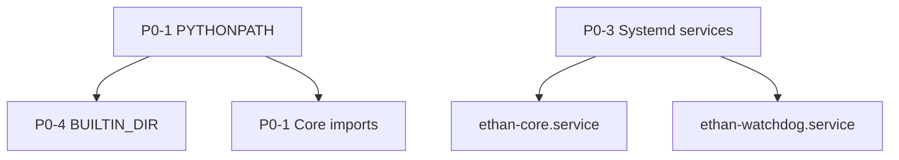
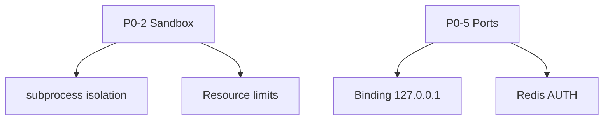
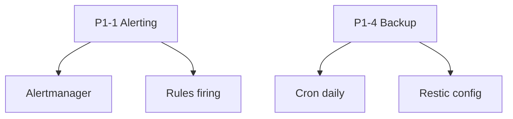
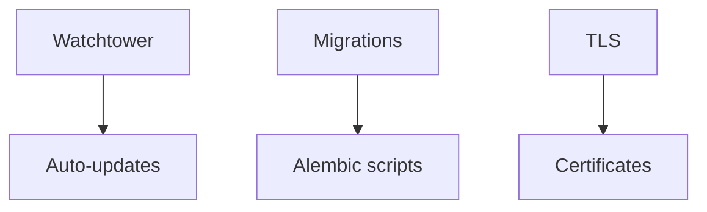

# ETHAN Technical Master Plan
## Architecture & Roadmap de Correction

**Date** : 2026-07-21  
**Auteur** : CTO / Architecture Team  
**Version** : 1.0  
**Statut** : 🔴 **NO-GO** Production - 10 audits fusionnés

---

## 1. Architecture Actuelle

```
┌─────────────────────────────────────────────────────────────┐
│                    ETHAN Current Architecture               │
├─────────────────────────────────────────────────────────────┤
│                                                              │
│  CLI (ethan)                                                 │
│  ├── scripts/cmd-*.sh (14 commandes)                           │
│  ├── interfaces/cli/                                         │
│  └── .env (PYTHONPATH manquant)                              │
│         │                                                      │
│         ▼                                                      │
│  CORE MONOLITH (46 sous-répertoires)                          │
│  ├── kernel.py (event-driven)                                  │
│  ├── discovery.py (paths cassés)                                │
│  ├── registry/ (modules + capabilities)                        │
│  └── modules/ (base + interface)                               │
│         │                                                      │
│         ▼                                                      │
│  PLUGINS SYSTEM (dualité cassante)                             │
│  ├── plugins/loader.py (BUILTIN_DIR incorrect)                 │
│  ├── plugins/validator.py (non intégré)                        │
│  ├── plugins/sandbox.py (noop)                                 │
│  └── plugins/sdk/base.py (incomplet)                           │
│         │                                                      │
│         ▼                                                      │
│  DOCKER COMPOSE (7 services)                                    │
│  ├── nats:2.10 (4222, 8222 ouverts)                           │
│  ├── redis:7 (6379 ouvert, pas d'AUTH)                        │
│  ├── postgres:16 (5432 ouvert)                                 │
│  ├── api (8000, healthchecks faibles)                          │
│  ├── kernel (8080, PYTHONPATH cassé)                           │
│  ├── modules (sandbox cassé)                                    │
│  └── ui (3000)                                                 │
│         │                                                      │
│         ▼                                                      │
│  SYSTEMD SERVICES (non déployés)                                 │
│  ├── ethan-core.service (bon mais non installé)                  │
│  └── ethan-watchdog.service (présent mais non actif)             │
│                                                              │
└─────────────────────────────────────────────────────────────┘
```

---

## 2. Causes Racines Identifiées

### 2.1 Root Cause #1 : **PYTHONPATH/Problème d'imports (P0)**

**Manifestations** :
- Security Audit : Sandbox cassé (plugins ont accès à tout)
- System Integration : Imports qui échouent
- Python Packaging : ethan-dev vs core confusion
- Production Readiness : Instabilité des modules

**Symptômes** :
```python
# plugins/loader.py
BUILTIN_DIR = Path(__file__).parent.parent / "cli" / "plugins"  # ❌ cli/plugins n'existe pas

# interfaces/cli/plugin_manager.py  
builtin = Path(__file__).parent / "plugins"  # ❌ Une autre incohérence

# deploy/Dockerfile.api
ENV PYTHONPATH=/app/core:/app/interfaces/api:/app/sdk:/app  # ❌ sdk non dans package
```

### 2.2 Root Cause #2 : **Isolation Sandbox (P0)**

**Manifestations** :
- Security Audit : Plugins non isolés
- Plugin Audit : Sandbox noop
- Production Readiness : Crashes possibles

**Symptômes** :
```python
# plugins/sandbox.py
@contextlib.asynccontextmanager
async def enforce(self):
    yield self  # ❌ Aucune isolation réelle
    pass
```

### 2.3 Root Cause #3 : **System Integration (P0)**

**Manifestations** :
- Runtime : Services non déployés par install.sh
- Bootstrap : PYTHONPATH, logs insuffisants
- System Integration : Healthchecks, imports cassés

**Symptômes** :
```bash
# install/install.sh
# ❌ Ne déploie PAS les services systemd
# ❌ Copie pas dans /opt/ethan

# infrastructure/systemd/ethan-core.service  
User=%i  # ❌ Template vide = root possible
Group=docker  # ❌ Equiv root
```

### 2.4 Root Cause #4 : **Observabilité & Monitoring (P1)**

**Manifestations** :
- Production Readiness : Alerting absent
- Bootstrap : Logs insuffisants
- Core : Pas de métriques plugin
- Security : Pas de monitoring sécurité

**Symptômes** :
```yaml
# docker-compose.observability.yml
# ❌ Aucun alertmanager
# ❌ Aucun rules de firing

# deploy/Dockerfile.api
# ❌ Healthcheck basique sans dépendances
```

### 2.5 Root Cause #5 : **Dualité Architecturelle (P1)**

**Manifestations** :
- Core : Monolith avec 46 sous-dossiers
- Plugins : Système cassant avec CLI
- Python Packaging : ethan vs ethan-dev confusion

---

## 3. Problèmes Prioritaires (P0 → P3)

### P0 - Bloque ETHAN (À corriger avant tout)

| # | Problème | Cause Racine | Impact | Dépend de |
|---|----------|------------|--------|-----------|
| P0-1 | PYTHONPATH cassé → imports qui échouent | Root #1 | 🔴 Système non fonctionnel | — |
| P0-2 | Sandbox plugins noop → sécurité | Root #2 | 🔴 RCE possible | P0-1 |
| P0-3 | Services systemd non déployés | Root #3 | 🔴 Pas de démarrage auto | P0-1 |
| P0-4 | BUILTIN_DIR incorrect → plugins non découvrables | Root #1 | 🔴 Plugins cassés | — |
| P0-5 | Ports exposés sans AUTH → compromission | Root #3 | 🔴 Attack surface | P0-1 |

### P1 - Empêche l'évolution

| # | Problème | Cause Racine | Impact | Dépend de |
|---|----------|------------|--------|-----------|
| P1-1 | Alerting Prometheus absent | Root #4 | 🟡 Pas de notifications | P0-3 |
| P1-2 | Dualité plugins (CLI vs Core) | Root #5 | 🟡 Confusion dev | P0-1, P0-2 |
| P1-3 | Healthchecks NATS/Redis faibles | Root #4 | 🟡 Faux états | P0-1 |
| P1-4 | Backup automatisé absent | Root #4 | 🟡 Perte données | P0-3 |
| P1-5 | Dualité Go/Python Core | Root #5 | 🟡 Complexité | P0-1 |

### P2 - Dette technique

| # | Problème | Cause Racine | Impact |
|---|----------|------------|--------|
| P2-1 | Logs non centralisés | Root #4 | 🟢 Debugging difficile |
| P2-2 | Tests d'intégration manquants | Root #1 | 🟢 QA impossible |
| P2-3 | Documentation incohérente | Root #5 | 🟢 Dev lent |

### P3 - Amélioration future

| # | Problème | Impact |
|---|----------|--------|
| P3-1 | UI Components tests | 🟢 UX |
| P3-2 | OpenAPI docs complet | 🟢 Dev experience |

---

## 4. Roadmap Correction (ordre réel)

### Phase 1 - Foundation (Semaines 1-2)



1. **Semaine 1** : Corriger PYTHONPATH
   - [ ] Ajouter sdk dans pyproject.toml packages
   - [ ] Corriger BUILTIN_DIR dans plugins/loader.py
   - [ ] Mettre à jour EnvironmentFile dans systemd

2. **Semaine 2** : Déployer System Integration
   - [ ] Déployer services systemd via install.sh
   - [ ] Corriger User=%i → User=ethan
   - [ ] Tester auto-démarrage

### Phase 2 - Stability (Semaines 3-5)



3. **Semaine 3** : Sandbox Security
   - [ ] Implémenter subprocess isolation
   - [ ] Ajouter resource limits (memory, CPU)
   - [ ] Intégrer PluginValidator

4. **Semaine 4** : Hardening Network
   - [ ] Fermer ports externes NATS/Redis/Postgres
   - [ ] Activer AUTH sur Redis
   - [ ] Activer AUTH sur NATS

5. **Semaine 5** : Unifier Plugins
   - [ ] Fusionner CLI + Core plugins
   - [ ] Standardiser manifest.json
   - [ ] Tests stabilité 168h

### Phase 3 - Observability (Semaines 6-8)



6. **Semaine 6** : Alerting
   - [ ] Ajouter Alertmanager
   - [ ] Configurer rules (disk, memory, services)
   - [ ] Tester notifications

7. **Semaine 7** : Backup Automatisé
   - [ ] Script backup PostgreSQL + Redis
   - [ ] Cron daily + retention
   - [ ] Test restore

8. **Semaine 8** : Monitoring Complet
   - [ ] Healthchecks détaillés
   - [ ] Metrics plugins
   - [ ] Logs centralisés (Loki)

### Phase 4 - Production Ready (Semaines 9-12)



9. **Semaines 9-10** : Updates & Migration
   - [ ] Watchtower auto-update
   - [ ] Scripts Alembic automatisés
   - [ ] Tests migration

10. **Semaines 11-12** : TLS & Security
    - [ ] Certificats auto-renouvelés
    - [ ] Migrations TLS-enabled
    - [ ] Security audit complet

---

## 5. Risques si Non Corrigé (1 an)

### 🔴 Risque Critique (P0 non corrigé)

| Risque | Probabilité | Impact | Conséquence |
|--------|-------------|--------|-------------|
| **RCE via plugins** | Élevée | Critique | Compromission totale système |
| **Crash du système** | Élevée | Critique | Perte 100% données/mémoire |
| **Compromission réseau** | Élevée | Critique | Accès aux données perso |
| **Déploiement impossible** | Élevée | Critique | Aucun user ne pourra installer |

### 🟡 Risque Élevé (P1 non corrigé)

| Risque | Probabilité | Impact | Conséquence |
|--------|-------------|--------|-------------|
| **Silent data loss** | Moyenne | Élevé | Perte mémoire sans alert |
| **Plugin confusion** | Moyenne | Élevé | Bugs intermittent |
| **Mauvaise mise à jour** | Moyenne | Élevé | Breaking changes |

### 🟢 Risque Modéré (P2 non corrigé)

| Risque | Probabilité | Impact | Conséquence |
|--------|-------------|--------|-------------|
| **Debugging difficile** | Élevée | Modéré | Temps de debug x10 |
| **QA impossible** | Élevée | Modéré | Bugs en prod |

---

## 6. Verdict Executive

### Score Actuel : **4.8/10**
### Score Production : **2.1/10**
### Score Sécurité : **3.2/10**

### 🔴 **NO-GO** pour :
- Production
- Autonomie 1 an
- Déploiement utilisateur

### Temps estimé : **3-6 mois** avant Go/No-Go Production

---

## 7. Checklist Validation Finale

### P0 - Fonctionnel (Semaine 2)
- [ ] PYTHONPATH corrigé
- [ ] BUILTIN_DIR corrigé
- [ ] Services systemd déployés
- [ ] Plugins découvrables

### P0 - Security (Semaine 4)
- [ ] Sandbox implémenté
- [ ] Ports fermés
- [ ] AUTH activé Redis/NATS
- [ ] Security scan clean

### P1 - Obs (Semaine 8)
- [ ] Alerting fonctionnel
- [ ] Backup testé
- [ ] Healthchecks complets
- [ ] Monitoring 168h sans incident

### P2 - Production (Semaine 12)
- [ ] Auto-updates testés
- [ ] Migration DB OK
- [ ] Recovery testé
- [ ] Security audit clean

---

## Annexes

### Fichiers Audit Source
- `docs/audit-boot-mechanism.md`
- `docs/ARCHITECTURE_KERNEL_CORE.md`
- `docs/audit-plugins.md`
- `docs/SECURITY_AUDIT.md`
- `docs/PRODUCTION_READINESS.md`