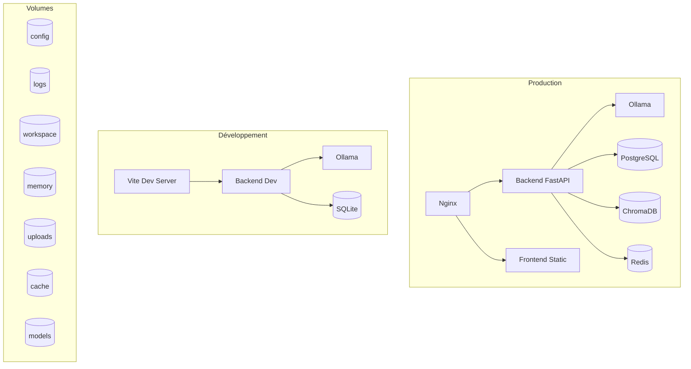

# Architecture d'Ethan

> Document d'audit et d'architecture — Juin 2026

---

## 1. Architecture Actuelle

### 1.1 Vue d'ensemble

Ethan est un assistant IA modulaire avec une architecture en couches :

```
┌─────────────────────────────────────────────────────┐
│                   CLI / Frontend                     │
├─────────────────────────────────────────────────────┤
│                   API Server (FastAPI)               │
├─────────────────────────────────────────────────────┤
│   Agents  │  Engine  │  Tools  │  Skills  │  MCP    │
├─────────────────────────────────────────────────────┤
│  Channels  │  Connectors  │  Memory  │  Learning   │
├─────────────────────────────────────────────────────┤
│         Core  │  Security  │  Telemetry             │
├─────────────────────────────────────────────────────┤
│              Rust (PyO3 bindings)                    │
└─────────────────────────────────────────────────────┘
```

### 1.2 Composants identifiés

#### Backend Python (`src/ethan/`)
- **Package principal** : `ethan` (installé via pip/uv)
- **CLI** : Interface en ligne de commande (Click)
- **Serveur** : API REST FastAPI
- **Agents** : Système multi-agents (orchestrateur, react, openhands, etc.)
- **Engine** : Moteurs d'inférence (Ollama, OpenAI, Anthropic, vLLM, etc.)
- **Tools** : Outils pour les agents (shell, browser, code, etc.)
- **Channels** : Canaux de communication (Slack, Discord, Telegram, WhatsApp, etc.)
- **Connectors** : Connecteurs de données (Gmail, Google Drive, Notion, etc.)
- **Memory** : Système de mémoire vectorielle (FAISS, ColBERT, BM25)
- **Learning** : Apprentissage par renforcement, optimisation
- **Security** : Sécurité (guardrails, injection, SSRF, audit)
- **Mining** : Minage de données (Pearl, vLLM)
- **Skills** : Système de compétences
- **Workflow** : Moteur de workflows
- **Telemetry** : Télémétrie et métriques
- **Speech** : Synthèse et reconnaissance vocale
- **MCP** : Model Context Protocol
- **A2A** : Agent-to-Agent protocol
- **Scheduler** : Planificateur de tâches
- **Sandbox** : Exécution sandboxée
- **System** : Configuration système
- **Evals** : Évaluations et benchmarks

#### Frontend (`frontend/`)
- **Framework** : React 19 + TypeScript + Vite
- **UI** : shadcn/ui + Tailwind CSS 4
- **Routing** : React Router
- **State** : Zustand
- **Desktop** : Tauri 2 (intégration native)

#### Rust (`rust/`)
- **Workspace** : 16 crates
- **PyO3** : Bindings Python pour les performances
- **Modules** : core, engine, agents, security, telemetry, traces, mcp, workflow, learning, scheduler, a2a, templates, recipes

#### Desktop (`desktop/` + `frontend/src-tauri/`)
- **Tauri** : Application de bureau native
- **Overlay** : Interface superposée
- **Auto-update** : Mise à jour automatique

### 1.3 Dépendances entre composants

```
Python Backend
  ├── Rust (via PyO3) — performances critiques
  │     ├── ethan-core (types, config, events)
  │     ├── ethan-engine (moteurs d'inférence)
  │     ├── ethan-security (sécurité)
  │     ├── ethan-telemetry (télémétrie)
  │     ├── ethan-traces (traces)
  │     ├── ethan-mcp (MCP protocol)
  │     ├── ethan-workflow (workflows)
  │     ├── ethan-learning (apprentissage)
  │     ├── ethan-scheduler (planificateur)
  │     ├── ethan-a2a (agent-to-agent)
  │     ├── ethan-templates (templates)
  │     └── ethan-recipes (recettes)
  │
  ├── Frontend (via API REST)
  │     └── React + TypeScript + Vite
  │
  └── Services externes (optionnels)
        ├── Ollama (inférence locale)
        ├── PostgreSQL (persistance)
        ├── ChromaDB (mémoire vectorielle)
        ├── Redis (cache)
        └── NATS (event bus)
```

### 1.4 Points faibles identifiés

| # | Problème | Impact | Priorité |
|---|----------|--------|----------|
| 1 | Docker monolithique (1 seul Dockerfile) | Images volumineuses, builds lents | Haute |
| 2 | docker-compose minimal (backend + ollama seulement) | Pas de séparation des services | Haute |
| 3 | Pas de Makefile | Pas d'automatisation standard | Haute |
| 4 | Pas de .dockerignore racine | Builds Docker lents | Haute |
| 5 | Pas de volumes persistants documentés | Perte de données potentielles | Haute |
| 6 | Pas de reverse proxy | Pas de TLS, load balancing | Moyenne |
| 7 | Pas d'utilisateur non-root dans Docker | Risque de sécurité | Haute |
| 8 | Pas de healthchecks dans Dockerfile | Pas de monitoring de santé | Moyenne |
| 9 | Pas de mode dev avec hot reload | Développement lent | Moyenne |
| 10 | Pas de réseau Docker dédié | Isolation réseau faible | Moyenne |
| 11 | Variables d'environnement non documentées | Configuration opaque | Haute |
| 12 | Pas de séparation dev/prod | Risque en production | Haute |
| 13 | Pas de scripts de build/test/lint standardisés | Qualité inégale | Moyenne |

---

## 2. Architecture Proposée

### 2.1 Structure cible

```
Ethan/
│
├── apps/                          # Applications déployables
│   ├── backend/                   # Backend Python (symlink vers src/)
│   ├── frontend/                  # Frontend React (existant)
│   └── desktop/                   # Desktop Tauri (existant)
│
├── packages/                      # Bibliothèques partagées
│   ├── core/                      # Types, config, events
│   ├── ai/                        # Engine, agents, learning
│   ├── plugins/                   # Système de plugins
│   └── tools/                     # Outils partagés
│
├── services/                      # Services déployables
│   ├── api/                       # API Gateway / FastAPI
│   ├── workers/                   # Workers asynchrones
│   └── memory/                    # Service de mémoire vectorielle
│
├── rust/                          # Workspace Rust (existant)
│   └── crates/                    # Crates Rust (existant)
│
├── deploy/                        # Déploiement
│   ├── docker/                    # Fichiers Docker
│   │   ├── Dockerfile.backend
│   │   ├── Dockerfile.frontend
│   │   ├── docker-compose.yml
│   │   ├── docker-compose.dev.yml
│   │   └── .env.example
│   ├── kubernetes/                # Manifests K8s (futur)
│   ├── systemd/                   # Service systemd (existant)
│   └── launchd/                   # Service launchd (existant)
│
├── configs/                       # Configuration (existant)
│   └── ethan/                # Config Ethan (existant)
│
├── scripts/                       # Scripts (existant)
│   ├── install/                   # Installation (existant)
│   ├── build.sh                   # Build
│   ├── test.sh                    # Tests
│   └── lint.sh                    # Lint
│
├── docs/                          # Documentation (existant)
│   ├── architecture.md            # Ce fichier
│   └── ...                        # Documentation existante
│
├── tests/                         # Tests (existant)
│
├── assets/                        # Assets (existant)
│
├── examples/                      # Exemples (existant)
│
├── tools/                         # Outils (existant)
│
├── .dockerignore                  # Docker ignore
├── .env.example                   # Variables d'environnement
├── Makefile                       # Automatisation
├── pyproject.toml                 # Projet Python (existant)
├── README.md                      # Documentation (existant)
└── uv.lock                        # Lock file (existant)
```

### 2.2 Architecture Docker

```
┌─────────────────────────────────────────────────────────┐
│                    jarvis-network                        │
│                                                          │
│  ┌──────────┐    ┌──────────┐    ┌──────────────────┐   │
│  │  nginx    │───▶│ backend  │───▶│  ollama / vllm   │   │
│  │ (reverse  │    │ (FastAPI)│    │  (inference)     │   │
│  │  proxy)   │    └────┬─────┘    └──────────────────┘   │
│  └──────────┘         │                                   │
│       │               │                                   │
│  ┌────┴──────┐   ┌────┴──────┐                           │
│  │  frontend │   │  workers  │                           │
│  │  (Vite)   │   │ (async)   │                           │
│  └───────────┘   └───────────┘                           │
│                                                          │
│  ┌──────────┐    ┌──────────┐    ┌──────────────────┐   │
│  │ postgres │    │  redis   │    │    chromadb      │   │
│  │ (option) │    │ (option) │    │  (vector store)  │   │
│  └──────────┘    └──────────┘    └──────────────────┘   │
└─────────────────────────────────────────────────────────┘
```

### 2.3 Volumes persistants

| Volume | Chemin conteneur | Usage |
|--------|-----------------|-------|
| `jarvis-config` | `/etc/ethan` | Configuration |
| `jarvis-logs` | `/var/log/ethan` | Logs |
| `jarvis-workspace` | `/workspace` | Espace de travail |
| `jarvis-memory` | `/var/lib/ethan/memory` | Mémoire vectorielle |
| `jarvis-uploads` | `/var/lib/ethan/uploads` | Fichiers uploadés |
| `jarvis-cache` | `/var/cache/ethan` | Cache |
| `jarvis-models` | `/var/lib/ethan/models` | Modèles locaux |
| `ollama-models` | `/root/.ollama` | Modèles Ollama |

### 2.4 Services optionnels (bonus)

| Service | Rôle | Dépendance |
|---------|------|------------|
| Ollama | Inférence LLM locale | Optionnel |
| PostgreSQL | Base de données relationnelle | Optionnel |
| ChromaDB | Base vectorielle | Optionnel |
| Redis | Cache / Queue | Optionnel |
| NATS | Event bus | Optionnel |
| Prometheus | Métriques | Optionnel |
| Grafana | Dashboard monitoring | Optionnel |
| Traefik | Reverse proxy | Optionnel |

---

## 3. Améliorations proposées

### 3.1 Dockerisation complète

- [x] Dockerfile.backend — Multi-stage, utilisateur non-root, healthcheck
- [x] Dockerfile.frontend — Build static, Nginx
- [x] docker-compose.yml — Production (backend + frontend + nginx + services optionnels)
- [x] docker-compose.dev.yml — Développement (hot reload, volumes montés)
- [x] .env.example — Toutes les variables documentées
- [x] .dockerignore — Exclusions optimisées

### 3.2 Sécurité

- [x] Utilisateur non-root dans les conteneurs
- [x] Variables d'environnement pour les secrets
- [x] .dockerignore pour éviter les fuites
- [x] Healthchecks pour la résilience
- [x] Réseau Docker dédié

### 3.3 Qualité

- [x] Makefile avec targets standardisées
- [x] Scripts de build, test, lint
- [x] Documentation mise à jour

### 3.4 Développement

- [x] Mode développement avec hot reload
- [x] Volumes montés pour le code
- [x] Logs détaillés
- [x] Variables d'environnement de développement

---

## 4. Diagramme de déploiement



---

## 5. Conclusion

L'architecture actuelle d'Ethan est déjà bien conçue avec une séparation claire des préoccupations. Les améliorations proposées se concentrent sur :

1. **Dockerisation** : Passage d'un Dockerfile monolithique à des images spécialisées
2. **Infrastructure** : Ajout de reverse proxy, volumes persistants, réseau dédié
3. **Qualité** : Makefile, scripts standardisés
4. **Sécurité** : Utilisateur non-root, healthchecks
5. **Développement** : Mode dev avec hot reload

Ces changements sont **non destructeurs** et préservent la compatibilité avec le code existant.