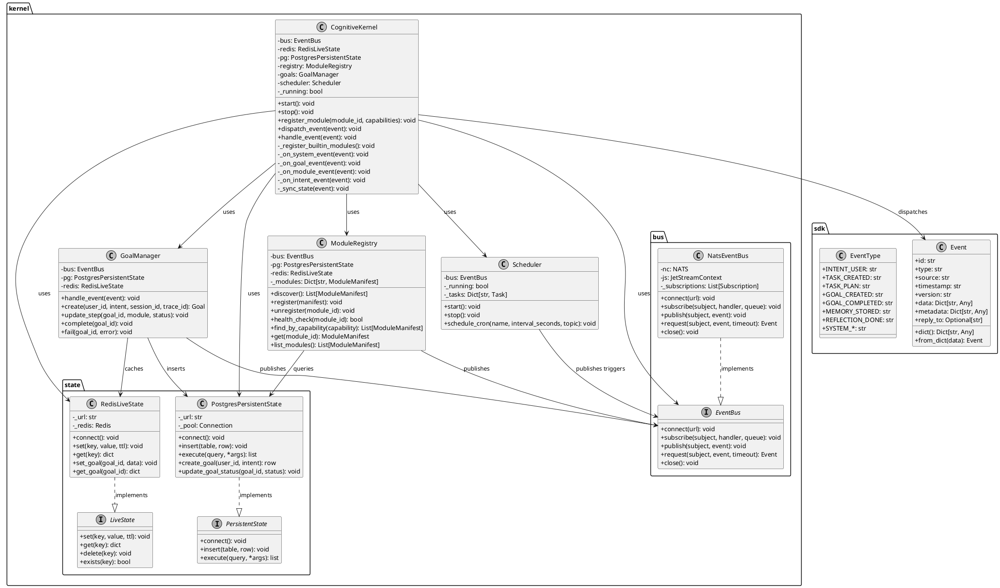

# C4 Architecture — Level 4: Code-Level View

## Vue d'ensemble

Cette vue montre les classes principales, interfaces et flux de code à l'intérieur du Cognitive Kernel.

## Diagramme ASCII

```
┌─────────────────────────────────────────────────────────────────────────┐
│                    Cognitive Kernel — Code View                         │
├─────────────────────────────────────────────────────────────────────────┤
│                                                                         │
│  ┌──────────────────────────────────────────────────────────────┐      │
│  │                     kernel.kernel.CognitiveKernel             │      │
│  │                                                               │      │
│  │  Attributes:                                                  │      │
│  │    bus: EventBus                                               │      │
│  │    redis: RedisLiveState                                       │      │
│  │    pg: PostgresPersistentState                                 │      │
│  │    registry: ModuleRegistry                                    │      │
│  │    goals: GoalManager                                          │      │
│  │    scheduler: Scheduler                                        │      │
│  │    _running: bool                                              │      │
│  │                                                               │      │
│  │  Public API:                                                   │      │
│  │    start()                                                     │      │
│  │    stop()                                                      │      │
│  │    register_module(module_id, capabilities)                    │      │
│  │    dispatch_event(event)                                       │      │
│  │    handle_event(event)                                         │      │
│  └──────────────────────────┬───────────────────────────────────┘      │
│                             │                                          │
│         ┌───────────────────┼───────────────────┐                     │
│         │                   │                   │                     │
│         ▼                   ▼                   ▼                     │
│  ┌──────────────┐  ┌──────────────┐  ┌──────────────────────┐         │
│  │ GoalManager  │  │ModuleRegistry│  │  NatsEventBus         │         │
│  │              │  │              │  │                       │         │
│  │ + create()   │  │ + register() │  │ + subscribe()         │         │
│  │ + complete() │  │ + discover() │  │ + publish()           │         │
│  │ + fail()     │  │ + find_by_   │  │ + request()           │         │
│  │ + update_    │  │   capability()│ │ + close()             │         │
│  │   step()     │  │ + health_    │  │                       │         │
│  │              │  │   check()    │  │                       │         │
│  └──────┬───────┘  └──────┬───────┘  └───────────┬───────────┘       │
│         │                  │                       │                   │
│         │     ┌────────────▼────────────┐          │                   │
│         │     │      Scheduler         │          │                   │
│         │     │                        │          │                   │
│         │     │ + start() / stop()     │       Redis + PostgreSQL      │
│         │     │ + schedule_cron()      │          │                   │
│         │     │ + _task_loop()         │          │                   │
│         │     └────────────────────────┘          │                   │
│         │                                        │                   │
│         ▼                                        ▼                   │
│  ┌────────────────────────────────────────────────────────────┐        │
│  │                    RedisLiveState                           │        │
│  │  + set(key, value, ttl)                                     │        │
│  │  + get(key) → dict                                          │        │
│  │  + set_goal(goal_id, data)                                  │        │
│  │  + set_heartbeat(module_id)                                 │        │
│  └────────────────────────────────────────────────────────────┘        │
│                                                                         │
│  ┌────────────────────────────────────────────────────────────┐        │
│  │              PostgresPersistentState                         │        │
│  │  + connect()                                                │        │
│  │  + insert(table, row)                                       │        │
│  │  + execute(query, *args)                                    │        │
│  │  + create_goal(user_id, intent) → row                       │        │
│  │  + update_goal_status(goal_id, status)                      │        │
│  └────────────────────────────────────────────────────────────┘        │
│                                                                         │
└─────────────────────────────────────────────────────────────────────────┘
```

## PlantUML



## Classes principales

### CognitiveKernel

```python
# kernel/kernel.py
class CognitiveKernel:
    """Event orchestrator."""
    
    def __init__(self, bus, redis, pg, registry, goals, scheduler):
        self.bus = bus
        self.redis = redis
        self.pg = pg
        self.registry = registry
        self.goals = goals
        self.scheduler = scheduler
        self._running = False

    async def start(self) -> None: ...
    async def stop(self) -> None: ...
    async def register_module(self, module_id: str, capabilities: List[str]) -> None: ...
    async def dispatch_event(self, event: Event) -> None: ...
    async def handle_event(self, event: Event) -> None: ...
```

### GoalManager

```python
# kernel/goals/manager.py
class GoalManager:
    """Goal lifecycle manager."""
    
    def __init__(self, event_bus, pg, redis): ...

    async def handle_event(self, event: Event) -> None: ...
    async def create(self, user_id: str, intent: dict, session_id: str, trace_id: str) -> Goal: ...
    async def update_step(self, goal_id: str, module: str, status: str) -> None: ...
    async def complete(self, goal_id: str) -> None: ...
    async def fail(self, goal_id: str, error: str) -> None: ...
```

### ModuleRegistry

```python
# kernel/registry/module_registry.py
class ModuleRegistry:
    """Module discovery and health."""
    
    async def discover(self) -> List[ModuleManifest]: ...
    async def register(self, manifest: ModuleManifest) -> None: ...
    async def unregister(self, module_id: str) -> None: ...
    async def health_check(self, module_id: str) -> bool: ...
    def find_by_capability(self, capability: str) -> List[ModuleManifest]: ...
```

### EventBus (NATS)

```python
# kernel/bus/nats_bus.py
class NatsEventBus:
    """NATS implementation of EventBus."""
    
    async def connect(self, url: str) -> None: ...
    async def subscribe(self, subject: str, handler, queue: str) -> None: ...
    async def publish(self, subject: str, event: Event) -> None: ...
    async def request(self, subject: str, event: Event, timeout: float) -> Event: ...
    async def close(self) -> None: ...
```

## Interfaces du SDK

```python
# sdk/event.py
@dataclass
class Event:
    id: str
    type: str
    source: str
    timestamp: str
    version: str
    data: Dict[str, Any]
    metadata: Dict[str, Any]
    reply_to: Optional[str]
    def dict() -> Dict[str, Any]: ...
    def from_dict(data: Dict[str, Any]) -> Event: ...

class EventType:
    INTENT_USER = "intent.user"
    TASK_CREATED = "task.created"
    TASK_PLAN = "task.plan"
    GOAL_CREATED = "goal.created"
    GOAL_COMPLETED = "goal.completed"
    MEMORY_STORED = "memory.stored"
    REFLECTION_DONE = "reflection.done"
    SYSTEM_KERNEL_STARTED = "system.kernel.started"
    # ...
```

## Flux de code interne

```
start()
    ├── subscribe("kernel.>", _on_system_event)
    ├── subscribe("goal.>", _on_goal_event)
    ├── subscribe("module.>", _on_module_event)
    ├── subscribe("intent.>", _on_intent_event)
    ├── _register_builtin_modules()
    │       └── register_module() × 4
    ├── scheduler.start()
    └── publish("system.kernel.started")

_on_intent_event(event)
    ├── goals.create(user_id, intent) → Goal
    ├── event.data["goal_id"] = goal.id
    └── dispatch_event(event)
            ├── registry.find_by_capability("handle.{type}")
            ├── bus.publish("module.dispatch.{type}", event)
            └── _sync_state(event)
                    ├── redis.set("event:{id}", payload, ttl=3600)
                    └── pg.insert("events", {...})