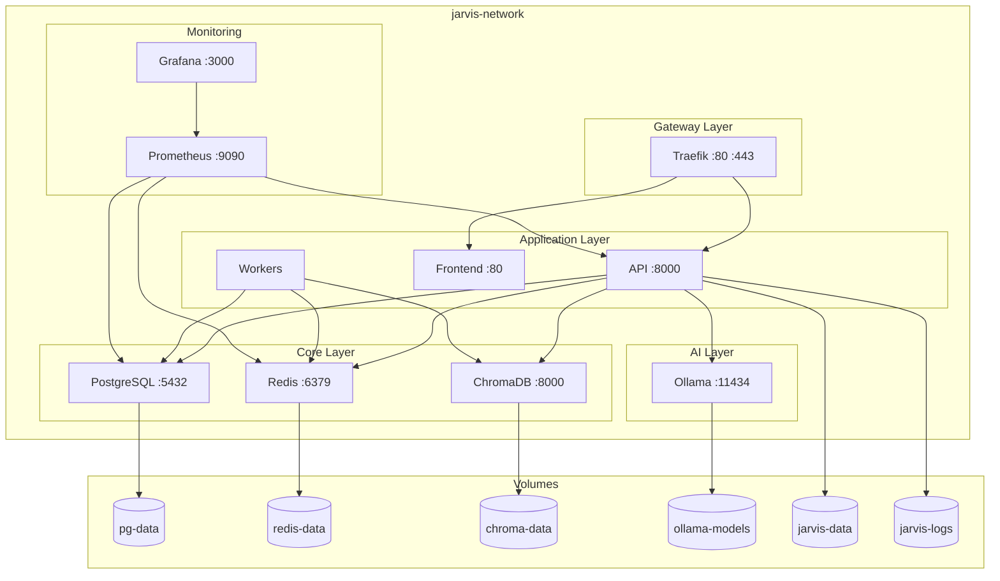

# Architecture Proposée — Jarvis OS

> Proposition d'architecture — Juin 2026
> Phase 2 : Conception de la nouvelle architecture

---

## 1. Vision

Transformer Ethan en **Jarvis OS**, une plateforme d'assistant IA modulaire, extensible et dockerisée.

### Principes directeurs

1. **Modularité** — Chaque composant est indépendant et interchangeable
2. **Plugin First** — Tout est extensible via des plugins
3. **API First** — Toutes les fonctionnalités sont accessibles via API
4. **Docker First** — Le déploiement Docker est le citoyen de première classe
5. **Local First** — Fonctionne par défaut sans cloud
6. **Provider Abstraction** — Les LLMs sont interchangeables via configuration
7. **Sécurité par défaut** — Auth, RBAC, rate limiting intégrés
8. **Observabilité** — Logs, métriques, traces dès la conception

---

## 2. Structure cible

```
JarvisOS/
│
├── apps/                          # Applications déployables
│   ├── api/                       # API Gateway (FastAPI)
│   ├── frontend/                  # Frontend React (existant)
│   ├── desktop/                   # Desktop Tauri (existant)
│   └── gateway/                   # Reverse proxy (Traefik/Nginx)
│
├── core/                          # Bibliothèques fondamentales
│   ├── agents/                    # Moteur d'agents
│   ├── llm/                       # Abstraction LLM
│   ├── memory/                    # Système de mémoire
│   ├── planner/                   # Planificateur de tâches
│   ├── scheduler/                 # Planificateur de jobs
│   ├── context/                   # Gestion de contexte
│   ├── events/                    # Système d'événements
│   ├── auth/                      # Authentification & RBAC
│   ├── config/                    # Configuration
│   └── security/                  # Sécurité
│
├── plugins/                       # Système de plugins
│   ├── browser/                   # Navigation web
│   ├── filesystem/                # Système de fichiers
│   ├── terminal/                  # Exécution shell
│   ├── docker/                    # Gestion Docker
│   ├── git/                       # Git operations
│   ├── python/                    # Exécution Python
│   ├── notes/                     # Prise de notes
│   ├── calendar/                  # Calendrier
│   ├── email/                     # Email
│   ├── weather/                   # Météo
│   ├── search/                    # Recherche web
│   ├── rag/                       # Retrieval-Augmented Generation
│   ├── vision/                    # Vision par ordinateur
│   ├── voice/                     # Synthèse/reconnaissance vocale
│   ├── homeassistant/             # Domotique
│   └── monitoring/                # Monitoring système
│
├── providers/                     # Fournisseurs LLM
│   ├── ollama/                    # Ollama (local)
│   ├── openai/                    # OpenAI API
│   ├── anthropic/                 # Anthropic API
│   ├── gemini/                    # Google Gemini
│   └── openrouter/                # OpenRouter
│
├── services/                      # Services externes
│   ├── postgres/                  # Base de données
│   ├── redis/                     # Cache & queue
│   ├── chromadb/                  # Base vectorielle
│   └── qdrant/                    # Base vectorielle (alternatif)
│
├── workers/                       # Workers asynchrones
│   ├── ingestion/                 # Ingestion de données
│   ├── embeddings/                # Génération d'embeddings
│   └── automation/                # Automatisation
│
├── sdk/                           # Kits de développement
│   ├── python/                    # SDK Python
│   └── typescript/                # SDK TypeScript
│
├── rust/                          # Workspace Rust (existant)
│   └── crates/                    # Crates existantes
│
├── deploy/                        # Déploiement
│   ├── docker/                    # Fichiers Docker
│   │   ├── Dockerfile.api
│   │   ├── Dockerfile.frontend
│   │   ├── docker-compose.yml
│   │   ├── docker-compose.dev.yml
│   │   ├── docker-compose.prod.yml
│   │   └── .env.example
│   ├── kubernetes/                # Manifests K8s
│   ├── systemd/                   # Service systemd (existant)
│   └── launchd/                   # Service launchd (existant)
│
├── configs/                       # Configuration (existant)
│
├── scripts/                       # Scripts (existant)
│
├── tests/                         # Tests (existant)
│
├── docs/                          # Documentation
│   ├── architecture/              # Architecture
│   ├── plugins/                   # Développement de plugins
│   ├── deployment/                # Déploiement
│   ├── development/               # Développement
│   ├── api/                       # API Reference
│   └── security/                  # Sécurité
│
├── examples/                      # Exemples (existant)
│
├── assets/                        # Assets (existant)
│
├── .env.example                   # Variables d'environnement
├── Makefile                       # Automatisation
├── pyproject.toml                 # Projet Python (existant)
└── README.md                      # Documentation (existant)
```

---

## 3. Architecture en couches

```
┌─────────────────────────────────────────────────────────────────────┐
│                         APPLICATIONS                                │
│  ┌──────────┐  ┌──────────┐  ┌──────────┐  ┌──────────────────┐   │
│  │   CLI    │  │ Frontend │  │  Desktop │  │  API Gateway     │   │
│  │ (Click)  │  │ (React)  │  │ (Tauri)  │  │  (FastAPI)       │   │
│  └────┬─────┘  └────┬─────┘  └────┬─────┘  └────────┬─────────┘   │
│       │              │             │                  │             │
├───────┴──────────────┴─────────────┴──────────────────┴─────────────┤
│                         CORE LAYER                                  │
│  ┌──────────┐  ┌──────────┐  ┌──────────┐  ┌──────────────────┐   │
│  │  Agents  │  │   LLM    │  │  Memory  │  │   Planner        │   │
│  ├──────────┤  ├──────────┤  ├──────────┤  ├──────────────────┤   │
│  │ Scheduler│  │  Events  │  │   Auth   │  │   Security       │   │
│  ├──────────┤  ├──────────┤  ├──────────┤  ├──────────────────┤   │
│  │  Config  │  │ Context  │  │  Skills  │  │   Workflow       │   │
│  └──────────┘  └──────────┘  └──────────┘  └──────────────────┘   │
│                                                                     │
├─────────────────────────────────────────────────────────────────────┤
│                      PLUGINS LAYER                                  │
│  ┌──────────┐  ┌──────────┐  ┌──────────┐  ┌──────────────────┐   │
│  │ Browser  │  │ Terminal │  │   Git    │  │   Filesystem     │   │
│  ├──────────┤  ├──────────┤  ├──────────┤  ├──────────────────┤   │
│  │  Search  │  │   RAG    │  │  Vision  │  │    Voice         │   │
│  ├──────────┤  ├──────────┤  ├──────────┤  ├──────────────────┤   │
│  │ Calendar │  │  Email   │  │ Weather  │  │  HomeAssistant   │   │
│  └──────────┘  └──────────┘  └──────────┘  └──────────────────┘   │
│                                                                     │
├─────────────────────────────────────────────────────────────────────┤
│                     PROVIDERS LAYER                                 │
│  ┌──────────┐  ┌──────────┐  ┌──────────┐  ┌──────────────────┐   │
│  │  Ollama  │  │  OpenAI  │  │ Anthropic│  │    Gemini        │   │
│  └──────────┘  └──────────┘  └──────────┘  └──────────────────┘   │
│                                                                     │
├─────────────────────────────────────────────────────────────────────┤
│                     INFRASTRUCTURE                                  │
│  ┌──────────┐  ┌──────────┐  ┌──────────┐  ┌──────────────────┐   │
│  │PostgreSQL│  │  Redis   │  │ ChromaDB │  │    Qdrant        │   │
│  └──────────┘  └──────────┘  └──────────┘  └──────────────────┘   │
└─────────────────────────────────────────────────────────────────────┘
```

---

## 4. Flux de données (nouvelle architecture)

### 4.1 Flux principal

```
Client (CLI/Web/Desktop)
    │
    ▼
┌─────────────────────┐
│   API Gateway       │  ← Auth, Rate Limiting, CORS
│   (FastAPI)         │
└────────┬────────────┘
         │
    ┌────┴────┐
    │  Router │
    └────┬────┘
         │
    ┌────┴──────────────────────────────────────┐
    │  Core Layer                               │
    │                                           │
    │  ┌─────────┐  ┌─────────┐  ┌──────────┐  │
    │  │ Agent   │─▶│ Planner │─▶│ Scheduler│  │
    │  │ Engine  │  │         │  │          │  │
    │  └────┬────┘  └─────────┘  └──────────┘  │
    │       │                                   │
    │  ┌────┴────┐  ┌─────────┐  ┌──────────┐  │
    │  │ LLM     │─▶│ Memory  │─▶│ Context  │  │
    │  │ Provider│  │ System  │  │ Manager  │  │
    │  └────┬────┘  └─────────┘  └──────────┘  │
    └───────┼───────────────────────────────────┘
            │
    ┌───────┴───────┐
    │  Plugin System │
    │  (discovery)   │
    └───────┬───────┘
            │
    ┌───────┴───────┐
    │  LLM Provider  │
    │  (abstraction) │
    └───────┬───────┘
            │
    ┌───────┴───────┐
    │  Ollama/OpenAI│
    │  /Anthropic   │
    └───────────────┘
```

### 4.2 Flux plugins

```
Plugin Manager
    │
    ├──► Scan plugins/ directory
    │       │
    │       ▼
    ├──► Load plugin.yaml
    │       │
    │       ▼
    ├──► Validate manifest
    │       │
    │       ▼
    ├──► Register capabilities
    │       │
    │       ▼
    └──► Make available to agents
```

### 4.3 Flux LLM Provider

```
Agent
    │
    ▼
LLM Provider Interface
    │
    ├──► Provider Registry
    │       │
    │       ▼
    ├──► Select provider (config)
    │       │
    │       ▼
    ├──► Format request (standard)
    │       │
    │       ▼
    ├──► Call provider API
    │       │
    │       ▼
    └──► Return standardized response
```

---

## 5. Plan de transition

### Phase 1 — Fondations (Sprint 1-2)

| # | Tâche | Fichiers | Statut |
|---|-------|----------|--------|
| 1 | Audit complet | `docs/architecture/current.md` | ✅ Fait |
| 2 | Proposition architecture | `docs/architecture/proposed.md` | 🔄 En cours |
| 3 | Dockerfiles multi-stage | `deploy/docker/Dockerfile.*` | ✅ Fait |
| 4 | docker-compose (dev + prod) | `deploy/docker/docker-compose.*.yml` | ✅ Fait |
| 5 | .env.example | `.env.example` | ✅ Fait |
| 6 | .dockerignore | `.dockerignore` | ✅ Fait |
| 7 | Makefile | `Makefile` | ✅ Fait |
| 8 | README mis à jour | `README.md` | ✅ Fait |

### Phase 2 — Core & Plugins (Sprint 3-4)

| # | Tâche | Description |
|---|-------|-------------|
| 9 | Structure `core/` | Déplacer les modules core dans `core/` |
| 10 | Structure `plugins/` | Créer l'API de plugins |
| 11 | Structure `providers/` | Créer l'abstraction LLM |
| 12 | Structure `apps/` | Séparer les applications |
| 13 | Période de transition | Conserver les anciens chemins |

### Phase 3 — Services & Workers (Sprint 5-6)

| # | Tâche | Description |
|---|-------|-------------|
| 14 | Services Docker | PostgreSQL, Redis, ChromaDB |
| 15 | Workers | Ingestion, embeddings, automation |
| 16 | API Gateway | Traefik/Nginx configuration |
| 17 | Healthchecks | Monitoring des services |

### Phase 4 — Sécurité & Observabilité (Sprint 7-8)

| # | Tâche | Description |
|---|-------|-------------|
| 18 | Auth system | JWT, API keys, RBAC |
| 19 | Rate limiting | Par utilisateur, par endpoint |
| 20 | Prometheus metrics | Métriques exposées |
| 21 | Grafana dashboards | Monitoring visuel |
| 22 | Structured logging | JSON logs |

### Phase 5 — CI/CD & Documentation (Sprint 9-10)

| # | Tâche | Description |
|---|-------|-------------|
| 23 | GitHub Actions | Lint, test, build, publish |
| 24 | Documentation API | OpenAPI/Swagger |
| 25 | Documentation plugins | Guide de développement |
| 26 | Documentation déploiement | Guide complet |

---

## 6. Diagramme de déploiement Docker



---

## 7. Spécifications techniques

### 7.1 API Gateway (apps/api/)

```python
# Structure proposée
apps/api/
├── __init__.py
├── main.py              # FastAPI application
├── dependencies.py      # Dépendances (auth, db)
├── middleware.py        # Middleware (CORS, logging, rate limit)
├── routes/
│   ├── __init__.py
│   ├── chat.py          # Chat endpoints
│   ├── agents.py        # Agent management
│   ├── memory.py        # Memory endpoints
│   ├── plugins.py       # Plugin management
│   ├── auth.py          # Authentication
│   ├── admin.py         # Admin endpoints
│   └── health.py        # Health checks
├── models/
│   ├── __init__.py
│   ├── chat.py
│   ├── agent.py
│   └── common.py
└── schemas/
    ├── __init__.py
    └── openapi.py        # OpenAPI documentation
```

### 7.2 Plugin System (plugins/)

```yaml
# plugin.yaml — Manifest standard
name: browser
version: 1.0.0
description: Web browser automation plugin
author: Jarvis OS Team
license: Apache-2.0

capabilities:
  - browse_web
  - extract_content
  - take_screenshot
  - fill_forms

dependencies:
  python:
    - playwright>=1.40
  system:
    - chromium

config:
  headless: true
  timeout: 30000
  user_agent: "JarvisOS/1.0"

entrypoint: main.py
```

### 7.3 LLM Provider Interface (providers/)

```python
# Interface standardisée pour tous les providers
class LLMProvider(ABC):
    """Interface abstraite pour les fournisseurs LLM."""

    @abstractmethod
    async def chat(
        self,
        messages: list[dict],
        model: str | None = None,
        temperature: float = 0.7,
        max_tokens: int | None = None,
        stream: bool = False,
    ) -> ChatResponse:
        """Chat completion."""
        ...

    @abstractmethod
    async def embed(
        self,
        texts: list[str],
        model: str | None = None,
    ) -> list[list[float]]:
        """Generate embeddings."""
        ...

    @abstractmethod
    async def list_models(self) -> list[str]:
        """List available models."""
        ...

    @property
    @abstractmethod
    def name(self) -> str:
        """Provider name."""
        ...
```

### 7.4 Memory System (core/memory/)

```python
# Interface unifiée pour la mémoire
class MemorySystem(ABC):
    """Système de mémoire unifié."""

    @abstractmethod
    async def store(
        self,
        key: str,
        value: Any,
        namespace: str = "default",
        metadata: dict | None = None,
    ) -> None:
        """Store a value in memory."""
        ...

    @abstractmethod
    async def retrieve(
        self,
        key: str,
        namespace: str = "default",
    ) -> Any | None:
        """Retrieve a value from memory."""
        ...

    @abstractmethod
    async def search(
        self,
        query: str,
        namespace: str = "default",
        limit: int = 10,
    ) -> list[MemoryResult]:
        """Semantic search across memory."""
        ...

    @abstractmethod
    async def delete(
        self,
        key: str,
        namespace: str = "default",
    ) -> None:
        """Delete a value from memory."""
        ...
```

---

## 8. Rétrocompatibilité

### 8.1 Période de transition

Pendant la transition, les anciens chemins restent fonctionnels :

```python
# Ancien import (toujours fonctionnel)
from ethan.agents import Agent

# Nouvel import (recommandé)
from jarvis.core.agents import Agent
```

### 8.2 Shim layer

```python
# shims.py — Pont de compatibilité
import warnings

def __getattr__(name):
    warnings.warn(
        f"Import from 'ethan' is deprecated. Use 'jarvis' instead.",
        DeprecationWarning,
        stacklevel=2,
    )
    # Rediriger vers le nouveau module
    ...
```

### 8.3 Calendrier de migration

| Période | Anciens chemins | Nouveaux chemins |
|---------|----------------|------------------|
| Mois 1-2 | ✅ Supportés | ✅ Disponibles |
| Mois 3-4 | ⚠️ Deprecation warning | ✅ Recommandés |
| Mois 5+ | ❌ Supprimés | ✅ Uniques |

---

## 9. Métriques cibles

| Métrique | Actuelle | Cible |
|----------|----------|-------|
| Taille image Docker | >2GB | <500MB |
| Temps de build Docker | >10min | <3min |
| Temps de démarrage | >30s | <5s |
| Couverture de tests | ~60% | >80% |
| Documentation API | Aucune | OpenAPI complète |
| Plugins supportés | 0 (intégré) | 15+ |
| Providers LLM | 4 (intégré) | 5+ (interchangeables) |

---

## 10. Prochaines étapes

1. ✅ Audit complet — `docs/architecture/current.md`
2. 🔄 Proposition d'architecture — `docs/architecture/proposed.md`
3. ⬜ Phase 3 : Restructuration des dossiers
4. ⬜ Phase 4 : Dockerisation complète
5. ⬜ Phase 5 : Système de plugins
6. ⬜ Phase 6 : Abstraction LLM
7. ⬜ Phase 7 : Documentation