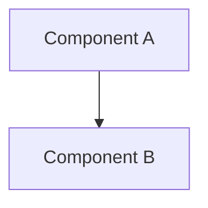

# RFC-NNN: [Titre court et descriptif]

> **Statut** : Draft | Proposed | Accepted | Implemented | Rejected
> **Auteur** : [Nom]
> **Date** : [YYYY-MM-DD]

---

## Context

Pourquoi cette RFC est nécessaire. Quel problème résout-elle ?

## Objective

Objectifs clairs et mesurables de cette RFC.

## Scope

Ce qui est inclus dans cette RFC :
- Point 1
- Point 2

## Non-scope

Ce qui est explicitement EXCLU de cette RFC :
- Point 1
- Point 2

## Design

Description détaillée de la solution proposée.

### Architecture



### Interfaces

```python
# Exemple d'interface
class NewComponent:
    async def method(self) -> str:
        ...
```

### Configuration

```yaml
# Exemple de configuration
feature:
  enabled: true
  option: value
```

## Alternatives Considered

| Alternative | Pros | Cons |
|-------------|------|------|
| Solution A | ... | ... |
| Solution B | ... | ... |

## Implementation Plan

1. Étape 1 — [Description] (Effort: X jours)
2. Étape 2 — [Description] (Effort: X jours)
3. Étape 3 — [Description] (Effort: X jours)

## Risks

| Risque | Impact | Probabilité | Mitigation |
|--------|--------|-------------|------------|
| ... | ... | ... | ... |

## Rollback Plan

Comment revenir en arrière si cette RFC échoue.

## Validation Criteria

Comment vérifier que cette RFC est correctement implémentée :
- [ ] Critère 1
- [ ] Critère 2
- [ ] Critère 3

---

## References

- [ADR-XXX](link)
- [Issue #XXX](link)